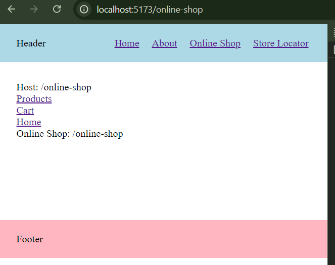

# Micro frontends with independent routing

When thinking about using a [micro frontends](https://en.wikipedia.org/wiki/Microfrontend) architecture for a frontend application, there are some complexities that we have to think about, that don't exists when building a monolithic frontend. One of which is, how do we handle client side routing? In a typical monolithic SPA (single page application), there would only be one router which handles all the routes and navigation between them. So considering that we want to use a micro frontends architecture, we could simply have each of our micro frontends use the same router (and same version of that router), and nest the MFE's (micro frontends) as routes, inside a main parent router.

But what if we wanted to have each of our MFE's use different routers, or even different frontend frameworks all together? For example we might want to do this for the following reasons, among others:

-   Different teams responsible for building and deploying different sections of the application
-   Migrating a legacy codebase from an old framework / router to a new one using the [strangler pattern](https://www.geeksforgeeks.org/strangler-pattern-in-micro-services-system-design)
-   One section of the application needs to use a certain framework / router for technical reasons

In this case, ideally we'd like to be able to compose our application of MFE's, which can each be potentially built and maintained by different teams, using different frameworks and/or routers, with different development lifecycles, and can be deployed independently of each other. In this article we will explore how we can achieve this. There are tools like [Single-SPA](https://single-spa.js.org/) which can be used to help solve some of the problems we will discuss in this article, but I think it can often be helpful to try to understand how to achieve something like this "from scratch" (or reasonably close) before bringing in a library or framework to get the job done.

## Project structure

We will create one "Host" application which will act as the shell that our MFE's will sit within. We will then create 2 MFE applications which can be developed completely independently of the host, but will be rendered inside the host, when the user visits certain routes.

Our example application will be the website for a chain of grocery stores. The main "Host" application will contain things that always display, like the header and the footer. Then lets say we have the following 2 features, for which we will create 2 MFE's:

-   Online shop - renders at `/online-shop/*` routes
-   Store locator - renders at `/store-locator/*` routes

For the host application we will use React, and [React Router](https://reactrouter.com/en/main) for the router. For the online shop we will also use React, but for the router we will use [Tanstack Router](https://tanstack.com/router/latest/docs/framework/react/overview). And finally for the store locator, we will use Vue, and it's built in [Vue Router](https://router.vuejs.org/introduction.html).

To get started we will just create a folder called manual_micro_frontends to contain our entire project, and inside it we will create separate directories for each application.

```
host/
onlineShop/
storeLocator/
```

We will use [Vite](https://vitejs.dev/) to generate and serve our react applications, so we will generate a new vite/react app inside of the `host` directory. After following the vite docs to create a new application using the react/javascript template, we will remove all the boilerplate JSX and styling, along with the excess files inside the `src` directory, and apply a small CSS reset. We should then be left with just the following inside our src directory:

```
// host/src/main.jsx
import { createRoot } from "react-dom/client";
import App from "./App.jsx";
import "./index.css";

createRoot(document.getElementById("root")).render(<App />);
```

```
// host/src/index.css
* {
    box-sizing: border-box;
    margin: 0;
    padding: 0;
}
```

```
// host/src/App.jsx
function App() {
    return <div>Host</div>;
}

export default App;
```

We will repeat the above process for online shop application. The only difference being in the online shop application we will also delete the `index.css` file. Styling micro frontends is another problem that needs some thought, but it's outside the scope of this tutorial, so for the sake of focusing our routing, we will just style everything in the host application's index.css file.

```
// onlineShop/src/main.jsx
import { createRoot } from "react-dom/client";
import App from "./App.jsx";

createRoot(document.getElementById("root")).render(<App />);
```

```
// onlineShop/src/App.jsx
function App() {
    return <div>Host</div>;
}

export default App;
```

We should then be able to install dependencies in each application, and run them both separately on different ports, and see our outputs in the browser:


## The "Host" application

First we will install `react-router-dom`, and create a minimal router including the following routes:

-   A "root route" which will act as a layout route, rendering common UI that appears on every other route, in our case just a header. This route will be the parent of every other route
-   "/" - just part of the host appliaction
-   "/about" - also just part of host
-   "/online-shop" - the route which will render our Online Shop MFE
-   "/store-locator" - the route which will render our Store Locator MFE

```
// host/src/router.jsx
import { createBrowserRouter, Link, Outlet } from "react-router-dom";

export const router = createBrowserRouter([
    {
        element: (
            <div>
                <header>
                    Header
                    <nav>
                        <Link to="/">Home</Link>
                        <Link to="/about">About</Link>
                        <Link to="/online-shop">Online Shop</Link>
                        <Link to="/store-locator">Store Locator</Link>
                    </nav>
                </header>
                <main>
                    <Outlet />
                </main>
                <footer>Footer</footer>
            </div>
        ),
        children: [
            {
                path: "/",
                element: <div>Host: /</div>,
            },
            {
                path: "/about",
                element: <div>Host: /about</div>,
            },
            {
                path: "/online-shop/*",
                element: <div id="onlineShopContainer">Host: /online-shop</div>,
            },
            {
                path: "/store-locator",
                element: (
                    <div id="storeLocatorContainer">Host: /store-locator</div>
                ),
            },
        ],
    },
]);
```

We'll then modify our App.jsx to import and render the router

```
// host/src/App.jsx
import { RouterProvider } from "react-router-dom";
import { router } from "./router";

function App() {
    return <RouterProvider router={router} />;
}

export default App;
```

Next we'll add some minimal styling

```
// host/src/index.css
* {
    box-sizing: border-box;
    margin: 0;
    padding: 0;
}

header,
footer {
    height: 60px;
    padding: 0 30px;
    background-color: lightblue;
    display: flex;
    justify-content: space-between;
    align-items: center;
}

header nav {
    display: flex;
    gap: 20px;
}

main {
    padding: 30px;
    height: 250px;
}

footer {
    background-color: lightpink;
}
```

Finally (for now) we'll add two extra "root" div's in the index.html file. These div's are where we will mount our 2 MFE applications.

```
// host/src/index.html
<body>
    <!-- Host app mount -->
    <div id="root"></div>

    <!-- Online shop MFE mount -->
    <div id="onlineShopRoot"></div>

    <!-- Store locator MFE mount -->
    <div id="storeLocatorRoot"></div>

    <script type="module" src="/src/main.jsx"></script>
</body>
```

Now if we go back to our host app in the browser, we should have a nav with a link to each of our routes, and the code for each route should render in the main page when that route is active.


## Online Shop MFE

Again we will install the routing library, this time tanstack router, and set up a minimal router with a few routes. We will use tanstack router's [code based routing](https://tanstack.com/router/latest/docs/framework/react/guide/code-based-routing) (as opposed to their alternative, file base routing).

```
// onlineShop/src/router.jsx
import {
    createRootRoute,
    createRoute,
    createRouter,
    Link,
    Outlet,
} from "@tanstack/react-router";

const rootRoute = createRootRoute({
    notFoundComponent: () => null,
});

const baseRoute = createRoute({
    getParentRoute: () => rootRoute,
    path: "/online-shop",
    component: () => (
        <div>
            <div>
                <Link to="/online-shop/products">Products</Link>
            </div>
            <div>
                <Link to="/online-shop/cart">Cart</Link>
            </div>
            <div>
                <Link to="/">Home</Link>
            </div>
            <p>Online Shop: /online-shop</p>
            <Outlet />
        </div>
    ),
});

const productsRoute = createRoute({
    getParentRoute: () => baseRoute,
    path: "products",
    component: () => <div>Online Shop: /online-shop/products</div>,
});

const cartRoute = createRoute({
    getParentRoute: () => baseRoute,
    path: "cart",
    component: () => <div>Online Shop: /online-shop/cart</div>,
});

const routeTree = rootRoute.addChildren([
    baseRoute.addChildren([productsRoute, cartRoute]),
]);

export const router = createRouter({
    routeTree,
});
```

```
// onlineShop/src/App.jsx
import { RouterProvider } from "@tanstack/react-router";
import { router } from "./router";

function App() {
    return <RouterProvider router={router} />;
}

export default App;
```

Note that in the `router.jsx` file, we define a `notFoundComponent` on our root route, to render nothing. Most routing libraries provide a default "not found" component, but we need to override because we want our Online Shop MFE to render nothing when we are not at a route starting with `/online-shop`.

Also note that we added a link to `/` in the tanstack router. When we click this link, it will route us out of the online store MFE, and back into the host application.

Finally, we need to change the id of the element that we mount the react app inside of, to match the id of the div we created in the host app's index.html for mounting the Online Store MFE. And also change the id of the mount div in the online store's index.html, so it can mount correctly when running independently.

```
// onlineShop/src/main.jsx
createRoot(document.getElementById("onlineShopRoot")).render(<App />);
```

```
// onlineShop/index.html
<div id="onlineShopRoot"></div>
```

## Store locator MFE

## Rendering the MFE inside the host app

Now that we have a host application and an MFE, we will to integrate the MFE into the host application (we'll come back to the 2nd MFE, Store Locator, later on).

We already have a div in which to mount the Online Store MFE inside of the Host application's `index.html` file, and starting the host dev server with vite will take care of loading the javascript for the host application, but we need to also load the javascript of the Online Store MFE to render that application inside of the host.

For now we will use a quick fix in order to load the MFE, and we will return to this problem later on. To load the JS on the MFE, we will do the following steps:

-   Create a production build of our MFE using `npm run build` from inside the `onlineShop` directory.
-   Find the built js file inside of `onlineShop/dist/assets`. The file name will be different every time, something like `index-mbwqfhvj.js`.
-   Move the above js file inside of the host application's `public` directory.

Then in the host application's index.html file, we can now add a script tag referencing the online shop's built html file:

```
<script type="module" src="./public/index-mbwqfhvj.js"></script>
</body>
```

## MFE integration issues

### 1

So we now have the JS of the MFE linked inside the host application, we should be able to run the host app and see our online shop rendering inside of our host application. Lets take a look, we will run our host app and navigate to the `/online-store` route using our header link.


So we have our online shop app rendering, except it's actually rendering below our header, not inside the main page of our host where we want it to render. This is because we have to mount the MFE into a div that exists as soon as the html page loads (the div with id "onlineShopRoot" that we created), which comes after the root div of the host application in the dom.


The MFE mounts as soon as the host application mounts, but remains "dormant", not rendering anything, until we visit the `/online-shop` route.

So we need a way to render all of our online shop UI inside of the div with id "onlineShopContainer", which is rendered inside of the host application only when we are at a route starting with `/online-shop`. For this we can use React Portals.

Lets modify our `/online-shop` route code in the onlineShop router so that the UI for that route, and all it's child routes, are actually rendered inside the host application using a portal. We will render the portal inside the host's "onlineShopContainer" div:

```
// onlineShop/src/router.jsx
import { createPortal } from 'react-dom';
...
const baseRoute = createRoute({
    getParentRoute: () => rootRoute,
    path: "/online-shop",
    component: () =>
        createPortal(
            <div>
                <div>
                    <Link to="/online-shop/products">Products</Link>
                </div>
                <div>
                    <Link to="/online-shop/cart">Cart</Link>
                </div>
                <div>
                    <Link to="/">Home</Link>
                </div>
                <p>Online Shop: /online-shop</p>
                <Outlet />
            </div>,
            document.getElementById("onlineShopContainer")
        ),
});
```

As we've edited our online store MFE app, we need to rebuild it and re-link the JS file in the host app again (same steps as above).

Now if we visit the host app in the browser again, we can see the MFE is now rendering inside the main page of the host app.



### 2
